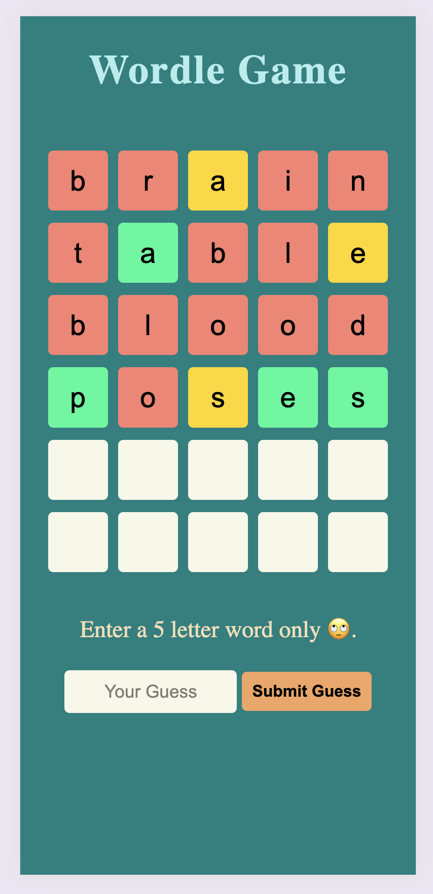

# Wordle Game

## Overview

The Wordle Game is a simple word puzzle game where player have to guess a hidden word within a limited number of attempts. Each guess provides feedback on how close the guess is to the hidden word by indicating correct letters and their positions.

### Key Features
- Interactive gameplay.
- Random word selection from a predefined list.
- Feedback on each guess with color-coded hints:
  - Green: Correct letter in the correct position.
  - Yellow: Correct letter in the wrong position.
  - Red: Incorrect letter.
- Limited number of attempts to guess the word.
- Responsive Design: The game layout is responsive and works well on different screen sizes.

## Screenshots

### mobile:

### web:

## Project Structure
1. index.html: The main HTML file that contains the structure of the game.
2. styles.css: The CSS file that styles the game elements.
3. myscript.js: The JavaScript file that contains the game logic.

## How to Run
To run the Wordle Game locally,
    1. Clone the repository.
    2. Open index.html in a web browser.
